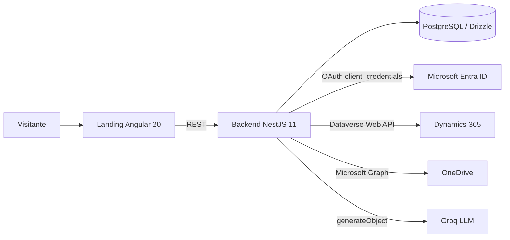

El sistema sigue una arquitectura de dos capas de aplicación (landing y backend) apoyadas en una base de datos PostgreSQL y en tres proveedores externos: Microsoft Entra \+ Dataverse, Microsoft Graph y Groq.

## Componentes principales

<CardGroup cols={2}>
  <Card title="Landing Angular" icon="globe">
    App Angular 20 con SSR desplegada en Vercel. Consume el backend a través de un cliente generado desde Swagger.
  </Card>

  <Card title="Backend NestJS" icon="code">
    API REST con módulos `Dynamics`, `IA`, `LandingProducts`, `MicrosoftProducts` y `OneDrive`.
  </Card>

  <Card title="PostgreSQL + Drizzle" icon="folder">
    Persistencia de leads y del catálogo de productos Microsoft con precios vigentes.
  </Card>

  <Card title="Servicios externos" icon="puzzle">
    Dataverse (Dynamics 365), Microsoft Graph (OneDrive) y Groq (LLM comercial).
  </Card>
</CardGroup>

## Diagrama lógico

## Módulos NestJS

Registrados en `src/app.module.ts`:

- `DynamicsModule` — Crea leads y pedidos en Dataverse y genera PDFs de pedido.
- `IaModule` — Chat estructurado con Groq para recopilar datos de contacto.
- `LandingProductsModule` — Expone el catálogo público de productos.
- `MicrosoftProductsModule` — Expone SKUs Microsoft con precio vigente.
- `OnedriveModule` — Sube y descarga e-books en PDF.

## Estructura de la landing

Rutas principales declaradas en `src/app/app.routes.ts`:

- `/` — Home, soluciones, nosotros, noticias, contacto.
- `/products/microsoft/*` — Azure Cloud, Copilot, Microsoft 365 (Business, Enterprise, Firstline), migración, correo híbrido, Office 365 Enterprise, Exchange Online, Teams Essentials.
- `/products/drata`, `/products/fortinet`, `/products/manage-engine`.
- `/templates/*` — Variantes comerciales de los mismos productos.
